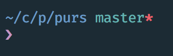

# Purs

[](https://travis-ci.org/xcambar/purs)

A [Pure](https://github.com/sindresorhus/pure)-inspired prompt in [Rust](https://www.rust-lang.org/).

Even more minimal, definitively faster and at least as pretty as the original Pure by [Sindre Sohrus](https://github.com/sindresorhus).



## Installation — Usage

1. Set up your Rust environment (use a Nightly build)
1. `$ cargo build --release`
1. Add the following to your ZSH configuration:

```
function zle-line-init zle-keymap-select {
  PROMPT=`/PATH/TO/PURS/target/release/purs prompt -k "$KEYMAP" -r "$?" --venv "${${VIRTUAL_ENV:t}%-*}"`
  zle reset-prompt
}
zle -N zle-line-init
zle -N zle-keymap-select

autoload -Uz add-zsh-hook

function _prompt_purs_precmd() {
  /PATH/TO/PURS/target/release/purs precmd
}
add-zsh-hook precmd _prompt_purs_precmd

```

## Why?

1. Learn some Rust
1. My Pure prompt felt slow on large repos (and indeed, was, compared to Purs)
1. Learn some Rust

## Questions

* I don't like...?

It's a pet project with wide areas for optimization and enhancement.
I'm really open to discussions, PRs a plus.

* Why doesn't it have...?

It's a pet project with wide areas for optimization and enhancement.
I'm really open to discussions, PRs a plus.


# License

MIT, see LICENSE file.
